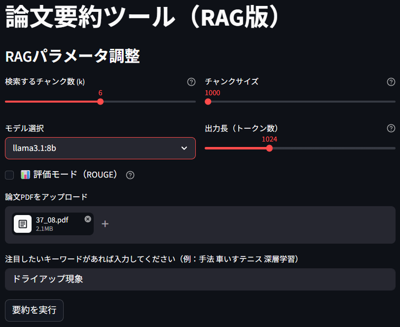
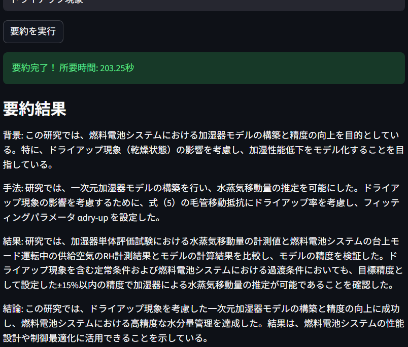
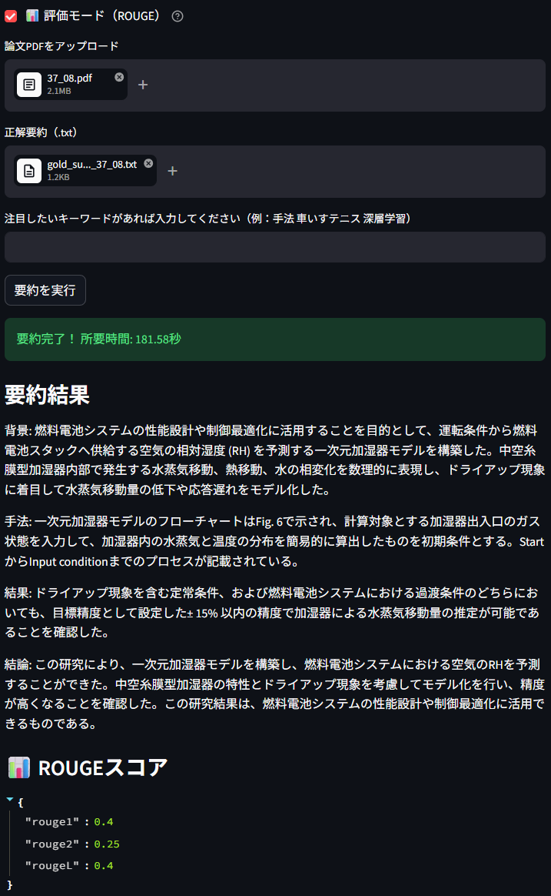

# paper-summarizer

RAG + LangChain を用いて，PDF論文を自動要約するツール
ローカルLLM（llama）を利用し，Docker Compose で実行

## 主な機能

- **PDF抽出**：PDF論文を読み込み，テキストデータに変換（`src/rag/loader.py`）
- **チャンキング**：テキストを一定のサイズ（chunk_size）で分割し，RAG用のチャンクを生成（`src/rag/splitter.py`）
- **埋め込み生成**：チャンクを埋め込みベクトルに変換し，RAG用のベクトル表現を生成（`src/rag/embedder.py`）
- **ベクトル検索**：埋め込みベクトルをChromaDBに保存し，クエリに基づいて類似チャンクを検索（`src/rag/vectorstore.py`）
- **LLM要約**：Ollama（llama）を用いて，RAGで取得したチャンクをもとに論文を要約（`src/rag/summarizer.py`）
(要約は「背景」「手法」「結果」「結論」の4セクションで出力するよう内部Promptで指示)
- **前処理**：図表周りの文字や脚注，参考文献リストなど，一部不要な部分を除去（`src/rag/preprocessor.py`）
(ただし，完全に不要部分を除去できているわけではない)
- **Rouge評価**：生成された要約とゴールドスタンダード要約を比較し，ROUGEスコア（rouge1, rouge2, rougeL）を計算（`src/eval/rouge_evaluator.py`）
- **評価モード**：Streamlit UIからゴールドスタンダード要約ファイルをアップロードし，評価モードで要約を生成すると，ROUGEスコアを自動で計算
- **UI（Streamlit）**：ブラウザ上からPDFをアップロードし，RAGパラメータ（k, chunk_size）やModel選択を調整しながら要約を生成可能
- **コンテナ化（Docker）**：Docker Compose を用いて環境を構築し，誰でも同じ環境でツールを実行可能
- **テスト・CI**：RAGパイプラインやROUGE評価のテストを実装し，GitHub Actions によるCIで自動実行

## 技術スタック

- Python
- LangChain (RAG Framework)
- Streamlit (Web UI)
- ChromaDB (Vector Database)
- Rouge (評価指標)
- Ollama（ローカルLLM: llama）
- Docker / Docker Compose
- pytest / GitHub Actions

## セットアップ

### 1. リポジトリのクローン

```bash
git clone https://github.com/avoseven/paper-summarizer.git
cd paper-summarizer
```

### 2. Docker Compose で起動

```bash
docker compose up --build summarizer
```
Streamlitが起動するので，ブラウザで `http://localhost:8501` にアクセス

## 使用方法

1. Streamlitアプリの起動
```bash
docker compose up summarizer
```
ブラウザで `http://localhost:8501` にアクセスすると，論文要約ツールのUIが表示されます

2. RAGパラメータの調整
   - 検索チャンク数 (k)：RAGで検索するチャンク数を指定（Default：6）
   - チャンクサイズ (chunk_size)：PDFを分割する際の1チャンクあたりの文字数を指定（Default：1000）
   - 出力長 (トークン数)：出力Textの長さ上限を指定 (Default：1024)

これらのパラメータを変更すると，要約の精度や速度に影響します．詳細は「評価・実験結果」セクションを参照

3. Model選択
   - llama3.2:1b：比較的高速だが低精度
   - llama3.1:8b：比較的高精度だが低速
   - (llama3.1:8b-istruct-q4_1)

3. PDF論文をアップロード

4. 評価モード（任意）
   - 評価モード (ROUGE)：チェックを入れると，評価モードが有効になります
   - 正解要約 (.txt)：正解要約（ゴールドスタンダード）のテキストファイルをアップロードしてください

評価モードでは，生成された要約とゴールドスタンダード要約を比較し，ROUGEスコア（rouge1, rouge2, rougeL）を計算します

5. Keyword入力 (任意)
   - 注目したい単語があれば入力してください
   - RAG検索時に，user_queryとして追加されます
   - 制限はありませんが，長くなると精度が落ちる可能性があります
   - 必ず要約に反映されるとは限りません

6. 要約を実行
   - 「要約を実行」ボタンをクリックすると，LLM（Ollama）による要約が開始されます
   - 完了すると，要約時間・要約文・評価モードならRouge-scoreが表示されます

## UI Image

### Top画面
PDFをアップロードし，モデルやRAGパラメータを設定



### 要約結果
処理が完了すると，要約文と要約時間を表示



### 評価Mode
GoldStandard要約をアップロードして実行，完了するとRouge-scoreが末尾に追加される



## プロジェクト構成
```
paper-summarizer/
├── Dockerfile
├── docker-compose.yml
├── requirements.txt
├── requirements-dev.txt
├── .gitignore
├── README.md
├── src/
│   ├── __init__.py
│   ├── main.py # Streamlit UI
│   ├── rag/
│   │   ├── __init__.py
│   │   ├── loader.py       # PDF読み込み
│   │   ├── preprocessor.py # 前処理
│   │   ├── splitter.py     # テキスト分割（チャンキング）
│   │   ├── embedder.py     # 埋め込み生成
│   │   ├── vectorstore.py  # ベクトルDB（ChromaDB）の操作
│   │   └── summarizer.py   # LLMによる要約
│   └── eval/
│       └── rouge_evaluator.py   # Rouge-scoreによる評価
├── tests/
│   ├── fixture/             # sample.pdf, 論文PDF, GoldStandard要約(.txt)
│   ├── __init__.py
│   ├── test_integration.py  # RAGパイプラインの結合テスト
│   ├── test_eval.py         # ROUGE評価のテスト
│   ├── test_loader.py       # PDF読み込みのテスト
│   ├── test_vectorstore.py  # Vector化のテスト
│   └── test_splitter.py     # チャンク分割のテスト
└── .github/workflows/
    └── test.yml             # GitHub Actions のCI設定
```

### RAGパイプライン

1. **PDF読み込み**（`loader.py`）  
   - PDFをテキストに変換
2. **チャンキング**（`splitter.py`）  
   - `RecursiveCharacterTextSplitter` でテキストを分割
   - `chunk_size` と `overlap` を調整可能
3. **埋め込み生成**（`embedder.py`）  
   - チャンクをベクトル化
4. **ベクトルDB保存**（`vectorstore.py`）  
   - ChromaDBに保存
   - コレクションのクリア機能あり（`clear_vectorstore`）
5. **検索と要約**（`summarizer.py`）  
   - 関連チャンクを検索（`k` を調整）
   - LLM（llama）で要約生成

## 評価・実験結果

RAG + LangChain + Ollama による論文要約の精度・挙動を評価するため，以下の実験を実施

### 1. モデル比較（1B vs 8B）

| Model         | 要約時間[秒] | Rouge1 | Rouge2 | RougeL | 目視評価 | 注記                 |
|---------------|-------------|--------|--------|--------|----------|----------------------|
| llama3.2:1b   | 25.4       | 0.095  | 0.000  | 0.080  | ×        |                      |
| llama3.1:8b   | 119.5      | 0.221  | 0.100  | 0.221  | 〇       | 結果が情報不足       |

- 8Bは1Bに比べてRougeが約2.3倍，目視評価も向上
- ただし要約時間は約4.7倍
- → 8Bを使うべき（精度優先）

<details>
<summary>要約文(1B)</summary>
モデルの定義と計算

車輪の持ち手: ハンドリムの剛体と、手部の剛体の間に作用する仮想的なダンパの力として定義した。
手部接触点と車軸の距離: 車輪の半径より小さい場合に、式(1)で表される力が作用する。
(F = (手部接触点の速度) - (車輪の回転速度))
車いすモデルの寸法: 市販の競技用車いす(OX Engineering 社、TRV 型)を参考にした。
車輪とキャスタの位置: 左右の車輪と車体前部についた左右のキャスタが接しており、転倒防止のため後部にサブキャスタがついています。
2 台のカメラを設置した。
人体モデルの寸法: 左右の車輪と車体前部についた左右のキャスタが接しており、転倒防止のため後部にサブキャスタがついています。
4 個のマーカーを貼付けた。
車いすモデルの寸法: 左右の車輪と車体前部についた左右のキャスタが接しており、転倒防止のため後部にサブキャスタがついています。
4 個のマーカーを貼付けた。
結果

手部・ハンドリム間の力: (F = (手部接触点の速度) - (車輪の回転速度))
車いすモデルの動作: 3 回漕ぐ動作をフレームレート100fps で撮影した。
結論

研究結果は、深層強化学習手法を用いて実競技環境での車いすテニスの漕ぎ動作を生成するシミュレーション手法を構築しました。
これらのシミュレーションの結果は、敗者より勝者の方が長い距離を移動していることや、熟練選手ほどラリー中の平均移動速度が速いことが報告されています。
</details>
<details>
<summary>要約文(8B)</summary>
背景： 車いすテニスは近年人気を高めている競技で、日本人選手が男子シングルスや女子シングルスなど様々なクラスで活躍している。試合中の移動距離や移動速度について比較した結果、敗者よりも勝者の方が長い距離を移動し、熟練選手ほどラリー中の平均移動速度が速いことが報告されている。

手法： 本研究では深層強化学習手法を用いて実競技環境での車いすテニスの漕ぎ動作を生成するシミュレーション手法を構築することを目的とする。車体モデルは市販の競技用車いすを参考にし、人体モデルは頭部から足部までの17個の剛体で構成された三次元剛体リンクである。床反力を算出するためにMagic Formulaと呼ばれる実験同定モデルを用いた。

結果： 本研究では、PPOアルゴリズムを使用して車いすテニスの漕ぎ動作を生成するシミュレーション手法を構築した。実験参加者は男子大学生1名であり、モーションキャプチャスーツを着用し、漕ぎ動作3回を複数試技行った。

結論： 本研究では車いすテニスの漕ぎ動作を生成するシミュレーション手法を構築した。深層強化学習手法を用いて実競技環境での車いすテニスの漕ぎ動作を生成することができた。これにより、車いすテニスの選手の技術向上に役立つ可能性がある。
</details>

---

### 2. k比較（3 vs 6）

| k   | 要約時間[秒] | Rouge1 | Rouge2 | RougeL | 目視評価 | 注記                 |
|-----|-------------|--------|--------|--------|----------|----------------------|
| 6   | 248.4       | 0.245  | 0.166  | 0.245  | 〇       | 繰り返し表現あり     |
| 3   | 119.5       | 0.221  | 0.100  | 0.221  | 〇       | 結果が情報不足       |

- k=6はk=3に比べてRougeが向上（特にRouge2）
- ただし要約時間は約2倍
- → k=6を使うべき（精度優先）

<details>
<summary>要約文(k=6)</summary>
背景: 車いすテニスの漕ぎ動作をシミュレートするために、深層強化学習アルゴリズムであるProximal Policy Optimization（PPO）が使用された。車いすのモデルはSIMPACKで作成され、MATLAB上で実装されたものが使用された。

手法: 車いすテニスのシミュレーションモデルを作成し、強化学習エージェントを用いて漕ぎ動作を生成する方法が採用された。エージェントはマルチボディダイナミクスを考慮して車いすの運動を学習し、関節角度と重心速度を目標として報酬を与えられた。

結果: 学習により得られた動作では手部が車輪より内側に入り込んでおり、参照動作とは一致しなかった。

結論: この研究は車いすテニスの漕ぎ動作のシミュレーションに深層強化学習アルゴリズムを適用し、車いすの運動を学習する方法を提案した。車いすテニス選手の技術向上に役立つ可能性がある。この研究は車いすテニスの漕ぎ動作のシミュレーションに深層強化学習アルゴリズムを適用し、車いすの運動を学習する方法を提案した。
</details>
<details>
<summary>要約文(k=3)</summary>
背景： 車いすテニスは近年人気を高めている競技で、日本人選手が男子シングルスや女子シングルスなど様々なクラスで活躍している。試合中の移動距離や移動速度について比較した結果、敗者よりも勝者の方が長い距離を移動し、熟練選手ほどラリー中の平均移動速度が速いことが報告されている。

手法： 本研究では深層強化学習手法を用いて実競技環境での車いすテニスの漕ぎ動作を生成するシミュレーション手法を構築することを目的とする。車体モデルは市販の競技用車いすを参考にし、人体モデルは頭部から足部までの17個の剛体で構成された三次元剛体リンクである。床反力を算出するためにMagic Formulaと呼ばれる実験同定モデルを用いた。

結果： 本研究では、PPOアルゴリズムを使用して車いすテニスの漕ぎ動作を生成するシミュレーション手法を構築した。実験参加者は男子大学生1名であり、モーションキャプチャスーツを着用し、漕ぎ動作3回を複数試技行った。

結論： 本研究では車いすテニスの漕ぎ動作を生成するシミュレーション手法を構築した。深層強化学習手法を用いて実競技環境での車いすテニスの漕ぎ動作を生成することができた。これにより、車いすテニスの選手の技術向上に役立つ可能性がある。
</details>

---

### 3. chunk_size比較（1000 vs 1500）

| chunk_size | 要約時間[秒] | Rouge1 | Rouge2 | RougeL | 目視評価 | 注記                 |
|-----------|-------------|--------|--------|--------|----------|----------------------|
| 1500      | 123.4       | 0.213  | 0.020  | 0.174  | 〇       | 繰り返し表現あり     |
| 1000      | 119.5       | 0.221  | 0.100  | 0.221  | 〇       | 結果が情報不足       |

- chunk_size=1000の方がRouge2/RougeLが高い
- 要約時間はほぼ同じ
- → chunk_size=1000を使うべき

<details>
<summary>要約文(chunk_size=1500)</summary>
背景: 車いすテニスは、競技の技術と身体的能力を高めるために、漕ぎ動作の効率が重要なスポーツである。従来の研究では、実際の測定値に基づいて車いすの性能を評価することが多かったが、これには時間と費用がかかる。したがって、この研究では、深層強化学習技術を使用して車いすテニスの漕ぎ動作をシミュレーションし、車いすの形状や寸法の変更による影響を計算する方法を開発した。

手法: この研究では、SIMPACKで作成された車いすテニスのシミュレーションモデルとMATLABで実装された強化学習エージェントを使用した。エージェントは、参照動作に基づいた報酬を与えられ、関節角度と速度の模倣報酬とタスク報酬の重み付き和として表される即時報酬を受け取った。最大ステップ数は56（1.4秒）で、エピソード報酬の最大値は51.4586（エピソード1822）であった。

結果: この研究では、車いすテニスの漕ぎ動作をシミュレーションし、車いすの形状や寸法の変更による影響を計算する方法が開発された。得られた漕ぎ動作の結果は図1に示され、報酬が最大値となるエピソードで得られた動作を0.2秒ごとに示している。

結論: この研究では、車いすテニスの漕ぎ動作をシミュレーションし、車いすの形状や寸法の変更による影響を計算する方法が開発された。深層強化学習技術を使用して、車いすの性能を評価し、競技の技術と身体的能力を高めることができる。この研究は、車いすテニスの競技の向上に貢献する可能性があり、将来的には車いすテニス選手のトレーニングやコーチングに役立つ可能性がある。
</details>
<details>
<summary>要約文(chunk_size=1000)</summary>
背景： 車いすテニスは近年人気を高めている競技で、日本人選手が男子シングルスや女子シングルスなど様々なクラスで活躍している。試合中の移動距離や移動速度について比較した結果、敗者よりも勝者の方が長い距離を移動し、熟練選手ほどラリー中の平均移動速度が速いことが報告されている。

手法： 本研究では深層強化学習手法を用いて実競技環境での車いすテニスの漕ぎ動作を生成するシミュレーション手法を構築することを目的とする。車体モデルは市販の競技用車いすを参考にし、人体モデルは頭部から足部までの17個の剛体で構成された三次元剛体リンクである。床反力を算出するためにMagic Formulaと呼ばれる実験同定モデルを用いた。

結果： 本研究では、PPOアルゴリズムを使用して車いすテニスの漕ぎ動作を生成するシミュレーション手法を構築した。実験参加者は男子大学生1名であり、モーションキャプチャスーツを着用し、漕ぎ動作3回を複数試技行った。

結論： 本研究では車いすテニスの漕ぎ動作を生成するシミュレーション手法を構築した。深層強化学習手法を用いて実競技環境での車いすテニスの漕ぎ動作を生成することができた。これにより、車いすテニスの選手の技術向上に役立つ可能性がある。
</details>

---

### 4. user_query比較（無し vs 報酬 vs 今後の課題）

| user_query    | 要約時間[秒] | Rouge1 | Rouge2 | RougeL | 目視評価 | 注記                               |
|--------------|-------------|--------|--------|--------|----------|------------------------------------|
| 無し         | 93.5        | 0.170  | 0.000  | 0.151  | ×        | セクションと内容が合っていない     |
| 報酬         | 73.3        | 0.162  | 0.060  | 0.149  | ×        | セクションと内容が合っていない     |
| 今後の課題   | 87.7        | 0.411  | 0.316  | 0.411  | ×        | 繰り返し多数                       |

- 「今後の課題」をクエリにするとRougeが大幅に向上するが，繰り返し多数で読みにくい
- 「無し」「報酬」はRougeが低く，セクションと内容が合っていない
- → Rougeだけでは「読みやすさ・構造の正しさ」は測りきれない
- → user_queryによって要約内容が変化していることは確認できる

<details>
<summary>要約文(user_query無し)</summary>
背景： 車いすテニスは近年人気を高めている競技であり、日本人選手が男子シングルスや女子シングルスなどで活躍している。研究では、試合中の移動距離や移動速度について比較した結果、勝者よりも敗者の方が長い距離を移動し、熟練選手ほどラリー中の平均移動速度が速いことが報告されている。したがって、選手の技術向上のためには効率の良い移動が重要であり、漕ぎ動作そのものや漕ぎ動作における車いすの性能について評価する必要がある。

手法： 研究では、深層強化学習アルゴリズムであるProximal Policy Optimization（PPO）を用いて、実競技環境での車いすテニスの漕ぎ動作を生成するシミュレーション手法を構築した。人体モデルは頭部から足部までの17個の剛体で構成され、下肢については骨盤と左右大腿・左右下腿・左右足部が一つの剛体として定義された。車いすモデルの寸法は市販の競技用車いすを参考にし、主に座面やフレームから構成される車体、左右の車輪、車体前部の左右キャスタと後部のサブキャスタが6つの剛体により構成されている。床反力を算出したのはMagic Formula (Bakker, et al., 1987) と呼ばれる実験同定モデルである。

結果： 研究では、PPOを用いて車いすテニスの漕ぎ動作を生成するシミュレーション手法を構築し、実競技環境での車いすテニスの漕ぎ動作を生成した。人体モデルの各関節自由度については腰関節が1、左右肩関節が3、左右肘関節が2、左右手首関節が2と定義された。

結論： 研究では、深層強化学習アルゴリズムであるPPOを用いて実競技環境での車いすテニスの漕ぎ動作を生成するシミュレーション手法を構築し、人体モデルの各関節自由度については腰関節が1、左右肩関節が3、左右肘関節が2、左右手首関節が2と定義された。床反力を算出したのはMagic Formula (Bakker, et al., 1987) と呼ばれる実験同定モデルである。この研究は車いすテニスの用具の形状や寸法の変更による動作への影響をシミュレーション上で計算可能にすることを目的としている。
</details>
<details>
<summary>要約文(user_query = 報酬)</summary>
背景： 車いすテニスは近年人気を高めているスポーツで、日本人選手が男子シングルスや女子シングルスなど様々なクラスで活躍している。研究では、試合中の移動距離や移動速度について比較した結果、勝者よりも敗者の方が長い距離を移動し、熟練選手ほどラリー中の平均移動速度が速いことが報告されている。

手法： 本研究では、深層強化学習手法を用いて実競技環境での車いすテニスの漕ぎ動作を生成するシミュレーション手法を構築した。研究室で行われた深層強化学習によるクロスカントリー シットスキーの漕ぎ動作生成シミュレーションと実競技環境における車いすテニスの漕ぎ動作シミュレーションの両者の手法を組み合わせ、漕ぎ動作を生成した。

結果： 本研究では、PPO（Proximal Policy Optimization）アルゴリズムを用いて学習を行った。1エピソードの終了時刻は1.4秒とし、エージェントが観測と報酬を受け取り、行動を環境にわたす周期を0.025秒とした。エージェントは環境からシットスキーモデルを受け取った。

結論： 本研究では、深層強化学習手法を用いて実競技環境での車いすテニスの漕ぎ動作を生成するシミュレーション手法を構築した。結果は、PPOアルゴリズムを用いて学習を行ったことで、エージェントが観測と報酬を受け取り、行動を環境にわたす周期を0.025秒としたことで、漕ぎ動作を生成することができた。
</details>
<details>
<summary>要約文(user_query = 今後の課題)</summary>
背景: この研究では、車いすテニスのシミュレーションモデルを作成し、強化学習アルゴリズムを使用して車いすの漕ぎ動作を生成することを目的としています。人体モデルは17個の剛体で構成され、下肢は1つの剛体として定義されています。車いすモデルの寸法は市販の競技用車いすに基づいて決定されました。

手法: この研究では、Magic Formulaと呼ばれる実験同定モデルを使用して床反力を算出した。また、車輪の持ち手であるハンドリムの剛体と手部の剛体の間に仮想的なダンパの力として定義した。強化学習アルゴリズムにはProximal Policy Optimization（PPO）が使用されました。エージェントは環境からシットスキーモデルに関する観測と報酬を受け取り、行動を環境にわたす周期を0.025秒とした。

結果: この研究では、車いすの漕ぎ動作を生成するために強化学習アルゴリズムを使用しました。エージェントは環境からシットスキーモデルに関する観測と報酬を受け取り、行動を環境にわたす周期を0.025秒とした。結果として、車いすの漕ぎ動作が生成されました。

結論: この研究では、車いすテニスのシミュレーションモデルを作成し、強化学習アルゴリズムを使用して車いすの漕ぎ動作を生成することを目的としています。結果は車いすの漕ぎ動作が生成されたことです。この研究では、車いすテニスのシミュレーションモデルを作成し、強化学習アルゴリズムを使用して車いすの漕ぎ動作を生成することができました。
</details>

---

### 5. PDF構造の比較（4P vs 10P）

| ページ数 | 要約時間[秒] | Rouge1 | Rouge2 | RougeL | 目視評価 | 注記                 |
|---------|-------------|--------|--------|--------|----------|----------------------|
| 4       | 248.4       | 0.245  | 0.166  | 0.245  | 〇       | 繰り返し表現あり     |
| 10      | 110.6       | 0.529  | 0.166  | 0.3812 | 〇       |                      |

- ページ数が多いほうが要約時間が短く，一見するとおかしい結果に見える
- 4P論文は1頁1列、10P論文は1頁2列となっており，10Pの方が細かくChunk分けされることになる
- 結果としてRAGが多様な情報を拾いやすくなるため，10P論文の方が要約の質が高い
- また，LLMに与える文章量が小さくなるため要約時間が短くなると考えられる
- 逆に，4P論文は1チャンクが長くなり，要約の質・時間ともに低下しているものと考えられる
- → 単なる文章量だけでなく，PDF構造がRAGの挙動に影響する

<details>
<summary>要約文(4P)</summary>
背景: 車いすテニスの漕ぎ動作をシミュレートするために、深層強化学習アルゴリズムであるProximal Policy Optimization（PPO）が使用された。車いすのモデルはSIMPACKで作成され、MATLAB上で実装されたものが使用された。

手法: 車いすテニスのシミュレーションモデルを作成し、強化学習エージェントを用いて漕ぎ動作を生成する方法が採用された。エージェントはマルチボディダイナミクスを考慮して車いすの運動を学習し、関節角度と重心速度を目標として報酬を与えられた。

結果: 学習により得られた動作では手部が車輪より内側に入り込んでおり、参照動作とは一致しなかった。

結論: この研究は車いすテニスの漕ぎ動作のシミュレーションに深層強化学習アルゴリズムを適用し、車いすの運動を学習する方法を提案した。車いすテニス選手の技術向上に役立つ可能性がある。この研究は車いすテニスの漕ぎ動作のシミュレーションに深層強化学習アルゴリズムを適用し、車いすの運動を学習する方法を提案した。
</details>
<details>
<summary>要約文(10P)</summary>
背景: 燃料電池システムの性能設計や制御最適化に活用することを目的として、運転条件から燃料電池スタックへ供給する空気の相対湿度 (RH) を予測する一次元加湿器モデルを構築した。

手法: 多孔質中空糸膜型加湿器内部で発生する水蒸気移動、熱移動、水の相変化を数理的に表現し、ドライアップ現象に着目して水蒸気移動量の低下や応答遅れをモデル化した。

結果: 加湿器単体評価試験における水蒸気移動量の計測値および燃料電池システムの台上モード運転中の供給空気のRH計測結果とモデルの計算結果を比較して、モデルの精度を検証した。ドライアップ現象を含む定常条件、および燃料電池システムにおける過渡条件のどちらにおいても、目標精度として設定した± 15% 以内の精度で加湿器による水蒸気移動量の推定が可能であることを確認した。

結論: この研究により、一次元加湿器モデルを構築し、燃料電池システムにおけるRHの予測に活用することができた。さらに、このモデルはドライアップ現象を含む定常条件および過渡条件においても高精度で推定が可能であることを示した。この研究結果は、燃料電池システムの性能設計や制御最適化に役立つと期待される。
</details>

---

### 全体の結論

- モデルサイズが大きいほど精度は向上するが，要約時間も増加する
- RAGパラメータ（chunk_size, k）の調整により，精度と速度のトレードオフを調整できる
- user_queryやPDF構造もRAGの挙動に影響し，ROUGEだけでは「読みやすさ・構造の正しさ」は測れないため，目視評価も重要
- 本プロジェクトでは**精度優先**の観点から，`llama3.1:8b`, `chunk_size=1000`, `k=6` を推奨設定としています

### 元論文
要約に使用した元論文は下記の通り
1. 深層強化学習による車いすテニスの漕ぎ動作生成シミュレーション
   - https://www.jstage.jst.go.jp/article/sit/2025/0/2025_P-1-15/_article/-char/ja/
   - 上記実験1 ~ 4と，5の4Pで使用
2. 燃料電池システムにおける一次元加湿器モデルの構築
   - https://www.jstage.jst.go.jp/article/hondatechnicalreview/37/0/37_2025_37_8/_article/-char/ja
   - 上記実験5の10Pで使用

なお，tests/fixtureにも保存してある (それぞれ2025_P-1-15.pdf, 37_08.pdf)

## 今後の課題

本プロジェクトでは、以下の課題が残っており、今後の改善の方向性として検討しています。

### 1. セクションと内容の不一致への対策

- 現状の要約では，「背景」に結果が書かれるなど，セクションと内容が一致しないケースがある
- 後処理による構造チェック（例：要約テキストを再度LLMに投げてセクション分割を修正）などが考えられる

### 2. 重複表現の多さへの対策

- 要約結果に繰り返し表現がたびたび登場し，読みやすさが低下している
- 要約テキストを再度LLMに投げて「重複を削除した要約」を生成する後処理を検討する

### 3. さらに多様なParameterでの実験・最適値探索

- 現状の実験量では，RAGパラメータ（特にchunk_size）の最適値が十分に探索できていない
- chunk_size=1000でも大きすぎる可能性があり，より小さい値（例：500, 800）での実験が必要
- また，chunk_overlapやkの組み合わせも含め，グリッドサーチやベイズ最適化による探索を検討する

### 4. 前処理の強化

- 現状の前処理では，図表周りの文字など，まだ不要な部分を落とし切れていない
- 図表のキャプションや脚注が要約に混入すると，RAGが関係のない情報を拾ってしまい，要約の質が低下する可能性がある
- 正規表現やLLMを駆使して，さらに前処理を強化することを検討する

### 5. その他の改善方向（検討中）

- より大きなモデル（13B, 70B）での精度・速度・リソースのトレードオフ評価
- マルチモーダル対応（図表のキャプション抽出など）による要約の質向上
- 自動評価指標の拡充（Rouge以外に、BERTScoreやLLMベースの評価など）

## DBの中身をクリアする方法

`vectorstore.py` の `clear_vectorstore` 関数を利用すると，DBファイルを削除せずに中身だけをクリアできる

```python
from src.rag.vectorstore import clear_vectorstore

clear_vectorstore()
```

Streamlit UI から実行する際は，実行時に自動的にクリアされるようになっている

## テストの実行

RAGパイプラインの主要な処理を対象に，以下のテストを実装

- `tests/test_eval.py`：RougeEvaluatorによる要約結果の評価をテスト
- `tests/test_integration.py`：LLM部分をモック化して，RAGパイプライン全体が正しく動くか確認するテスト
- `tests/test_loader.py`：load_pdf_from_bytesが空でないDocumentリストを返すことを確認
- `tests/test_splitter.py`
   - split_documentsが空でないDocumentリストを返すことを確認
   - 分割後のチャンク数が増えることを確認
   - chunk_sizeがおおむね守られていることを確認
   - デフォルトchunk_size(1000)が使われることを確認
- `tests/test_vectorstore.py`
   - create_vectorstoreがドキュメントを正しく保存することを確認
   - search_similar_chunksが関連ドキュメントを返すことを確認
   - clear_vectorstoreでコレクションがクリアされることを確認

### 実行方法

```bash
docker compose run test
```

これにより，`tests/` 配下のテストが自動で実行されます

## CI (Continuous Integration)

GitHub Actions によるCIを設定

- ワークフローファイル：`.github/workflows/test.yml`
- 実行内容：
  - コードのチェックアウト
  - Dockerイメージのビルド
  - `docker compose run test` によるテスト実行

プッシュやプルリクエスト時に自動でテストが実行され，コード品質を担保しています